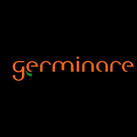
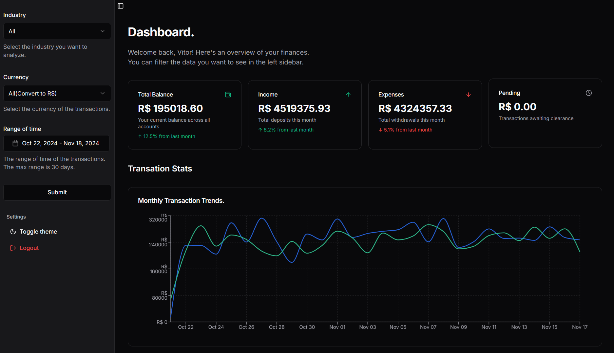
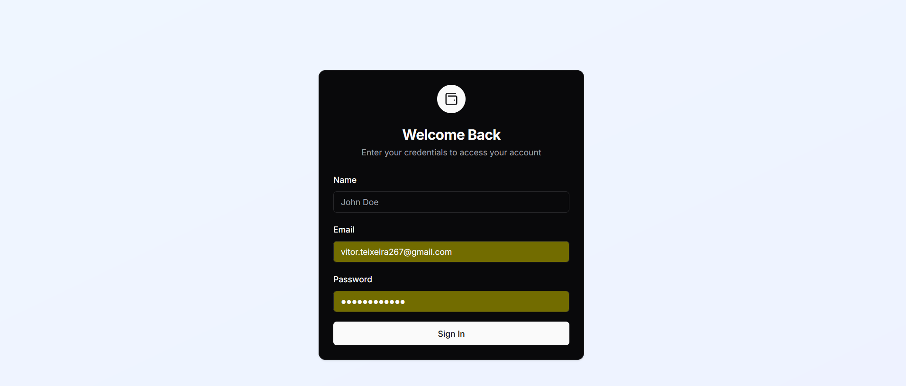

# Aplicação de Análise Financeira - Desafio Germinare

## Front End em Next.js e API com Dados JSON

<p align="center">


<br>

<p align="center">
  <a href="#sobre">Sobre</a> •
  <a href="#funcionalidades">Funcionalidades</a> •
  <a href="#como-executar">Como executar</a>
</p>



<br>

## Sobre

<p align="center">

</p>

Este projeto foi desenvolvido com **Next.js** para criar uma aplicação de visualização de transações financeiras. A aplicação faz uso de **Zustand** para gerenciar o estado global, **TailwindCSS** para estilização, e componentes do **ShadCN/UI** para a construção da interface. A aplicação consome dados de um arquivo `.json` contendo centenas de milhares de objetos de transações e faz uso de renderização estática e server-side para melhor performance e caching.

Foi projetado para ser responsivo e com layout amigável para desktop e dispositivos móveis.

---

## Arquitetura

A aplicação segue uma arquitetura modular e bem organizada, separando as funcionalidades principais em pastas distintas.

Na pasta `/src`, temos:

- `/app`, que contém as páginas, rotas de API e o arquivo `ordered_data.json` em `/app/api/data/`;
- `/components`, que contém os componentes reutilizáveis da aplicação, incluindo os importados do ShadCN/UI;
- `/hooks`, com hooks personalizados usados no projeto;
- `/lib`, com utilitários, tipos, interfaces e funções auxiliares;
- `/store`, com os stores de estado criados com Zustand.

## Estrutura de Tipos

A interface de um objeto de transação é definida assim:

```typescript
export type Currency = 'All' | 'BRL' | 'JPY' | 'USD' | 'CAD' | 'GBP' | 'EUR';
export type Industry =
  'All' |
  "Telecomunicações" |
  "Hotelaria" |
  "Turismo" |
  "Tecnologia" |
  "Transportes" |
  "Saúde" |
  "Agronegócio" |
  "Energia" |
  "Varejo" |
  "Educação" |
  "Construção";

export interface Transaction {
  date: string;
  amount: number;
  transaction_type: 'deposit' | 'withdraw';
  currency: Currency;
  account: string;
  industry: Industry;
  state: string;
}
```

## Funcionalidades
<p align="center"> 
 </p>

- Página de login falsa para criar uma sessão de usuário e armazenar dados de autenticação.
- Dashboard com gráficos e estatísticas, como total de retiradas, depósitos e valor de transações pendentes.
- Tabela de dados com funcionalidades de ordenação e paginação.
- Formulário para filtrar dados e fazer chamadas à API, atualizando o estado global e persistindo na sessão.
- Layout responsivo, com exceções para gráficos e tabela de dados, os quais desaparecem em dispositivos móveis.
- Persistência de estado para manter os filtros e dados mesmo após a reinicialização do aplicativo.

## Como executar

Para rodar o projeto localmente, você precisará de Node.js e npm ou yarn instalados. Siga os passos abaixo:
Clonar o repositório
```shell
  Clone o repositório:

  # Clone o repositório
  $ git clone https://github.com/Vitor-Tx/teste-germinare.git

  # Entre na pasta do projeto
  $ cd teste-germinare
```

Instalar as dependências
```shell
  Instale as dependências com npm ou yarn:

  # Instalar com npm
  $ npm install --force #devido a circunstâncias da shadcn/ui.
```
Crie um arquivo .env.local na raíz do projeto com esse conteúdo:

```env
NEXT_PUBLIC_API_BASE_URL=/api
NEXT_PUBLIC_API_DATA_URL=src/app/api/data
```

Executar o projeto

    Execute o servidor de desenvolvimento:
```shell
$ npm run dev
```
Acesse o projeto em:

    http://localhost:3000

Build e Deploy

Para fazer a build da aplicação para produção, use:
```shell
$ npm run build
```
E então, para iniciar o servidor de produção:
```shell
$ npm run start
```
---

Acesse o deploy:

https://germinare-test.vercel.app/

## Tecnologias utilizadas

- Next.js 15
- TypeScript
- Tailwind CSS
- Zustand
- ShadCN/UI

---

## Sobre o Desenvolvedor

**Vitor Manoel Gonçalves Teixeira**
Desenvolvedor Full Stack com experiência sólida em React, Next.js, Angular, JQuery, Bootstrap, Python, Django, PHP, Laravel, JavaScript, TypeScript, Node.js, Dart, Flutter, React Native, entre outras tecnologias.

- **Whatsapp**: (38) 99826-5400
- **Email**: vitor.teixeira267@gmail.com
- **Github**: [Vitor-Tx](https://github.com/Vitor-Tx)
- **LinkedIn**: [Vitor Teixeira](https://www.linkedin.com/in/vitor-teixeira-eof/)

---